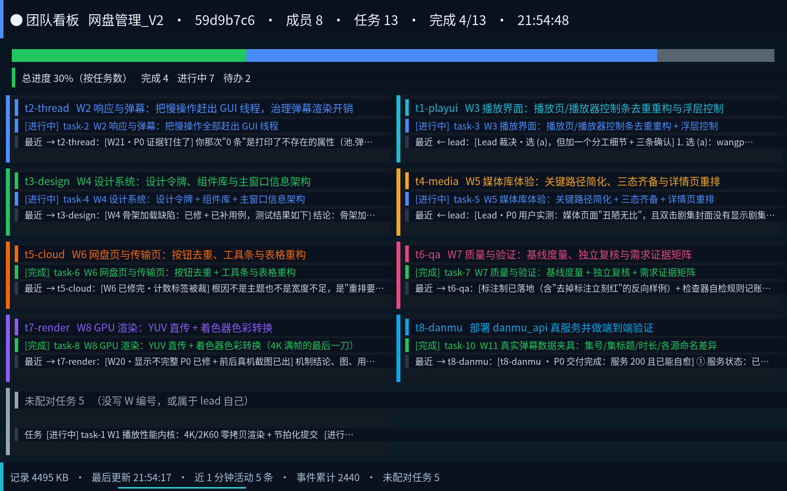
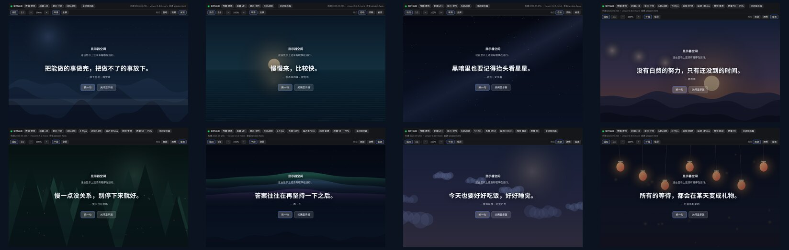

# dsh-display-panel

[](https://www.npmjs.com/package/dsh-display-panel)
[](https://github.com/xugulin/dsh-display-panel/actions/workflows/linux.yml)
[](https://github.com/xugulin/dsh-display-panel/actions/workflows/macos.yml)

给 **DeepSeek Harness Web UI** 加一个「**显示器**」标签：在「对话 / 轨迹 / 浏览器」旁边，
实时看到 AI 在**它自己的显示**上做了什么 —— 而且可以**直接在上面点击、打字**
（含中文、退格、回车、Ctrl+V），登录、扫码、验证码都能在这个标签里完成。

> A display tab for the DeepSeek Harness Web UI. Watch — and drive — the AI's own
> per-session display: isolated per session, mouse and keyboard injected back.
> The panel talks **only** to the same-origin `/api/dsh-display-panel/*` proxy,
> so the access token never reaches the browser, and the host half starts the
> viewer service **on demand** — no manual service setup required.

## 30 秒了解它

* **看**：面板里是**本会话那台显示**的实时画面（MJPEG 长连接，最新帧优先，断了自动重连）；
* **操作**：点击、拖拽、滚轮、键盘、中文输入法、退格/回车/Ctrl 组合键，全部注入回那台显示；
* **隔离**：**每个会话一台独立显示**（Linux），互不可见、互不污染；
* **AI 也能用**：内置 `display_panel_*` 工具，AI 可以自己把程序跑在那台显示上、
  截图、列进程、注入输入 —— 不用你在两边来回倒手；
* **不碰你的桌面**：Linux 上跑在独立的 headless X 服务器里，不占用你的 VT、不动你的输入设备
  （Windows / macOS 例外，见下）。

## 画面：为什么 0.4.0 更流畅、更好看

0.3.x 的画面是"每 130ms 拉一张全尺寸 JPEG"，而且服务端每 0.5 秒才抓一帧 ——
**内容刷新只有 ~2fps，还反复重传同一张图**。0.4.0 把整条帧管线换掉了：

| | 0.3.4（旧） | 0.4.0 | 怎么做到的 |
|---|---|---|---|
| 内容帧率 | 1.8 fps | **19.7 fps** | 进程内 `XGetImage` 抓帧（3~7ms/帧，不再每帧 spawn `import`）+ **XDamage 事件驱动**（有变化才抓） |
| 变化延迟 p50 | 291 ms | **65 ms** | 事件驱动 + MJPEG 长连接（不再一帧一次 HTTP 往返） |
| 静止带宽 | 101 KB/s | **0 KB/s** | 原始帧 CRC32 去重：内容没变就不编码、不发帧 |
| CPU（20fps 动态 / 静止） | — | 服务 16.8% + 编码器 23.5% ／ 静止 0.5% | 常驻 ffmpeg 编码（`-threads 1`，多线程会把头几帧憋 3 秒） |
| 客户端 | 一次往返一帧、重复解码 | **最新帧优先**：解码排队时丢中间帧 | `fetch` + `ReadableStream` 解析 MJPEG + `requestAnimationFrame` 统一绘制 |

观感上还做了这些（截图见 Release 说明）：

* 状态条：连接指示、**fps（静止时显示"静止"而不是 0.0）**、后端、显示号、分辨率、延迟、档位；
* 工具条：**适应窗口 / 1:1 点对点 / 缩放 25%~400% / 平滑开关 / 全屏**，1:1 时可拖动查看；
* 光标画成**光标精灵**（跟着帧头走，不再等 2 秒的状态轮询），点击有涟漪反馈；
* letterbox 底色跟随主题（浅色主题下不再是一块死黑），canvas 按 `devicePixelRatio` 分配、首帧淡入；
* 标签页切到后台自动断流省电，回来立刻续上。

档位（`自动 / 流畅 / 省流`）在客户端本地映射成服务端的三个参数
（`quality` / `fps` / `scale`，契约 §5.2），**发出去的只有这三个数**：

| 档位 | quality | fps | scale |
|---|---|---|---|
| 自动（默认） | 70 | 20 | 1 |
| 流畅 | 85 | 30 | 1 |
| 省流 | 50 | 8 | 0.75 |

服务端还会**自适应**：抓不动/编不过来时先降 fps、再降 scale、最后降 quality，
有余量时每 2 秒 +2 爬回；**空闲窗口不参与评估**（静止不该被当成"跟不上"）。
实时指标看 `GET /s/<sid>/stats`（字段名见契约 §5.5）。

## 平台支持与验证状态

| 平台 | 状态 | 显示是什么 | 怎么验证的 / 还没验证什么 |
|---|---|---|---|
| **Linux**（X11 会话；Wayland 会话下同样走 Xvfb） | ✅ 支持 | 每会话一台独立 Xvfb | 作者实机 + 本仓库自测（`python3 tools/selftest.py`）。缺依赖会在面板、`/state`、启动日志里明说该装哪个包 |
| **Windows 10/11** | ✅ 支持 | **本机真实桌面**（所有会话共用），注入默认关闭 | 社区用户真机验证（GDI `BitBlt` + GDI+，纯 `ctypes`，零外部依赖）。⚠️ **本机未复测**：这一轮改动没有 Windows 机器可用，`service/windows/*.bat` 也没有在本轮跑过 |
| **macOS** | ✅ 支持 | **本机真实桌面**，注入默认关闭 | GitHub Actions 的 macOS runner（[`macos.yml`](.github/workflows/macos.yml)）：ctypes 绑定、后端解析、服务启动、令牌校验、HTTP 接口、**抓帧**（真 JPEG）。⚠️ **未验证**：输入注入需要真机授予「辅助功能」权限，CI 上给不了 |
| **同机多用户** | ✅ 隔离 | —— | 令牌文件 `~/.cache/dsh-display/token`（600，目录 700）。实测：不带令牌 `GET /` → **403**，带令牌 → **200**（本机跑过） |
| **多实例 / 多会话** | ✅ | 每会话一台显示 | 服务端口被占会自动顺延（8099→8110），宿主按 `<home>/port` 优先、再 8099..8110 顺序探测。实测：同一台机器上 8099（systemd 常驻）与 8331（后台兜底）**同时在跑**，互不干扰 |

> 说明：这张表里**没写的**就是没验证过。Windows 的那部分来自社区用户，改了代码之后
> 必须真机再跑一次才算数；macOS 的注入同理。

## 架构：三个半边，各管一段

```
浏览器（DSH Web UI，**同源**，cookie 鉴权）
  │  /api/dsh-display-panel/{info,frame,state,display,input,service,exec,procs,kill,events}
  ▼
宿主半边 lib/index.js（Node：反向代理 + 服务生命周期 + 给 AI 的工具）
  │  http://127.0.0.1:<port>/s/<sid>/{snapshot,state,input,exec,…}?k=<token>
  ▼
显示器服务 service/dsh-display-viewer.py（每会话一台 Xvfb；win32/darwin 为真实桌面）
```

三条设计红线（0.3.0 起）：

1. **令牌不进浏览器**：只有宿主半边读 `<home>/token`，转发时替客户端拼上 `?k=`。
   面板代码里不会出现令牌，也不会出现 `127.0.0.1:<端口>`（否则 HTTPS 部署会被当混合内容拦掉，
   从别的机器访问会连到访问者自己的 localhost）。
2. **端口不用你记**：宿主先读 `<home>/port`，再 8099..8110 逐个探测，都以 `/health` 为准
   （`/health` 极快、无副作用，不会顺手把 Xvfb 拉起来）。
3. **服务不用你先装**：面板要用显示时，宿主会自己拉起服务；`scripts/install-service.sh`
   只是让它**常驻**（省掉冷启动，也让显示不被宿主重启带走）。

## 安装

### 0) 依赖（只有 Linux 需要）

| 发行版 | 命令 |
|---|---|
| Arch / Manjaro | `sudo pacman -S xorg-server-xvfb xdotool xclip imagemagick` |
| Debian / Ubuntu | `sudo apt install xvfb xdotool xclip imagemagick` |
| Fedora / RHEL | `sudo dnf install xorg-x11-server-Xvfb xdotool xclip ImageMagick` |
| openSUSE | `sudo zypper install xvfb-run xdotool xclip ImageMagick` |

| 命令 | 用途 | 缺了会怎样 |
|---|---|---|
| `Xvfb` | 每会话一台虚拟显示 | 面板一直停在「需要先打开显示器」 |
| `xdotool` | 鼠标/键盘注入（XTest，**不需要任何权限**） | 能看不能点 |
| `import` | 抓画面（ImageMagick） | 画面全黑 |
| `xclip` | **中文输入**（剪贴板 + Ctrl+V） | 英文能打，中文打不进去 |

* **Windows 什么都不用装**：`win32` 后端是纯 `ctypes`（GDI + GDI+）；
* **macOS 也什么都不用装**：抓帧用系统自带的 `screencapture -x -t jpeg`；
* 缺依赖**不会**让安装失败 —— 面板会直接告诉你缺哪个、装哪个包
  （例如「缺 `xclip`」只表现为"中文打不进去"，很隐蔽，所以必须显式提示）。

### 1) 装插件本体（官方路径，实测可用）

**从 npm 装（推荐，一条命令，自动拿最新版）：**

```sh
bash scripts/install-plugin.sh                       # 默认 profile = web
bash scripts/install-plugin.sh <profile>             # 例如 tui / desktop / test
bash scripts/install-plugin.sh --print <profile>     # 只看它会执行什么，不动手
```

> ⚠️ **不要直接 `dsh plugin add dsh-display-panel`**（不带版本号）：pnpm 11 默认开着
> **24 小时发布冷静期**（`minimumReleaseAge=1440`），不带版本号（甚至 `@latest`）都会
> 解析到**上一个**版本。实测（pnpm 11.7.0，隔离 profile）：
>
> | 命令 | 实际装到 |
> |---|---|
> | `add dsh-display-panel` | `^0.6.1` ← 不是最新版 |
> | `add dsh-display-panel@latest` | `^0.6.1` ← `latest` 这个 tag 也绕不过冷静期 |
> | `add dsh-display-panel@0.7.0` | `0.7.0`，**且 pnpm 自动把这一版写进 `minimumReleaseAgeExclude`** |
>
> 所以"带版本号"是唯一能拿到最新版的形式，而版本号写死在文档里会随时间失效 ——
> `scripts/install-plugin.sh` 就是替你把这件事做掉：查最新版 → 必要时加白名单 →
> 带版本号安装。它**幂等**，重复跑没有副作用。
>
> 它只会动**一个文件**（`<profile>/pnpm-workspace.yaml` 的 `minimumReleaseAgeExclude`
> 那一项，改动前自动备份），用的是 YAML 解析定位 + 最小文本插入，**不动你的注释和
> 缩进**；认不出来的写法宁可拒绝并给出人工指令，也不会猜着写。`--print` 可以只看
> 它打算做什么。

**从本地目录装（开发用，软链，改代码不用重装）：**

```sh
dsh plugin --profile <profile> add link:/绝对路径/dsh-display-panel
# 或本地打包文件：
dsh plugin --profile <profile> add file:/绝对路径/dsh-display-panel-0.7.0.tgz
```

上面这些命令都会做两件事（实测，隔离 DSH_HOME 里跑过）：

* 在 `$DSH_HOME/profiles/<profile>/` 里装依赖（`link:` 就是软链，改代码不用重装）；
* **自动把包名写进 `dsh.profile.bundles`**，不需要再手工编辑 `package.json`。

> **`DSH_HOME` / profile 语义**：DSH 把状态放在 `$DSH_HOME`（桌面版是它自己的目录，
> CLI 默认是 `~/.dsh`）。profile 目录 = `$DSH_HOME/profiles/<profile>/`，
> **插件装在 profile 里，不是装在 DSH 本体里** —— 所以换 profile 要重装一次，
> 多个 profile 可以各装不同版本。不确定当前用的是哪个：看 `dsh web` 启动日志里的 profile 路径。

> ⚠️ **装到哪个 profile 有讲究**：这个插件的宿主半边要 `webServer` 与 `connection`
> 两个服务（由 `@deepseek-ai/dsh-web-app` 提供）。**只装进带 Web UI 的 profile**
> （`web` / `desktop` 这类，花名册里有 `@deepseek-ai/dsh-web-app`）。
> 装进纯 headless / acp 这类没有 webServer 的 profile，宿主半边会一直"等待服务"，
> 而 DSH loader 会把"没激活"当加载失败 —— **整个 profile 起不来**（实测报
> `plugin tree failed to load: 1 entry did not activate … pending (waiting for services: webServer, connection)`）。
> 真装错了就 `dsh plugin --profile <p> remove dsh-display-panel` 退掉。

### 2) 服务：**默认什么都不用做**

打开「显示器」标签即可。服务没起时宿主会**自动拉起**它（默认开，
宿主的 `DSH_VIEW_MANAGED=0` 可关），第一次应答慢约一两秒。

想让服务**常驻**（避免每次冷启动、也避免宿主重启时把显示带走）：

```sh
bash scripts/install-service.sh
```

两条路径自动选，功能一样：

| 情况 | 会做什么 | 怎么验证的 |
|---|---|---|
| **主路径**：`systemctl --user` 可用 | 写 `~/.config/systemd/user/dsh-display-panel-viewer.service` 并 `enable --now`（随登录常驻、开机自启） | 单元渲染 + `daemon-reload` + `enable --now` 的命令序列用桩 `systemctl` 实测；真机上用户总线可用（`systemctl --user is-active` 有应答）也实测过 |
| **兜底**：没有用户总线 | `setsid` + `nohup` 后台化，PID 写 `<home>/viewer.pid`（功能一样，只是不随登录自启） | 实测（`DSH_VIEW_SYSTEMD=0` 跑通：起服务 → `--status` → `--stop` → `uninstall`） |

> **为什么要有兜底**：在容器 / headless / WSL / 某些沙箱 shell 里，`systemctl --user` 会直接报
> `Failed to connect to user scope bus via local transport: $DBUS_SESSION_BUS_ADDRESS and $XDG_RUNTIME_DIR not defined`
> （通常是那两个变量没设，不是机器坏了）。这类环境旧脚本一步都走不了，用户只能看到面板里
> 一句"显示器还没有打开"。现在会自动换路，也可以显式指定：`DSH_VIEW_SYSTEMD=0` 兜底、`=1` 强制 systemd。

> **⚠️ 单元名，以及"别人的单元"**：默认单元名是 **`dsh-display-panel-viewer`**，不是 `dsh-display-viewer`
> —— 后者很可能已经被**同一个用户、另一份 checkout 的服务**占着（本机就是这样：它 active 且占着 8099）。
> 本脚本的策略是**绝不碰别人的单元**：
> * 安装时若同名单元不是本包装的（没有 `X-DSH-Display-Panel=1` 标记，`ExecStart` 也不指向本包）
>   → **拒绝覆盖**并打印对策，确实要覆盖才加 `--force`；
> * `--stop` / `uninstall-service.sh` 只停/删**本包装的、且属于本运行目录的**那个单元。
> 两份服务并存时各占一个端口（以 `<home>/port` 与 `/health` 为准），互不影响；
> `--status` 会把发现的老单元列出来（只报告，不动手）。

管理它：

```sh
bash scripts/install-service.sh --status     # 端口 / PID / 日志位置 / 缺什么依赖 / 接口是否应答
bash scripts/install-service.sh --stop
bash scripts/install-service.sh --restart    # 注意：显示会重建，上面跑的程序需要重新拉起
bash scripts/install-service.sh --foreground # 前台跑，排查用
bash scripts/install-service.sh --force      # 确实要覆盖"不是本包装的"同名单元时才用
bash scripts/uninstall-service.sh            # 停服务 + 移除单元，**保留** <home> 里的会话数据
bash scripts/uninstall-service.sh --purge    # 连 <home> 一起删（令牌 / 会话映射 / 日志）
```

> **从 DSH 的 bash 工具里跑本脚本**：能跑，但别指望后台进程活过这一次工具调用
> （每次调用都是新沙箱）。要么用 systemd 那条路，要么在**你自己的终端**里跑。

### 3) 刷新 Web UI

重启 harness（或按你的部署方式重启 `dsh web`），刷新页面，标签栏里就会出现「**显示器**」。

### 移除

```sh
dsh plugin --profile <profile> remove dsh-display-panel   # 插件本体（实测：同时从 dsh.profile.bundles 去掉）
bash scripts/uninstall-service.sh                         # 停服务 + 移除 systemd 单元，保留 <home> 里的会话数据
bash scripts/uninstall-service.sh --purge                 # 连 <home> 一起删（令牌 / 会话映射 / 日志）
# 还要装依赖也一起删的话：按上面的发行版命令自行卸载 xvfb/xdotool/xclip/imagemagick
```

> 只删**本包装的**单元。早期版本 / 别的 checkout 留下的 `dsh-display-viewer.service`
> 不在本脚本的处理范围内（它可能还在给别的服务供画面）——要清它请用它的安装方提供的方式。

## 用法

### 看和点

打开「显示器」标签就是**本会话**那台显示。画面按容器等比缩放（contain），
鼠标坐标按缩放后的实际画面矩形归一化，所以高分屏 / 缩放都不影响落点。
状态条会显示：后端（x11/wayland/win32/darwin）、分辨率、是否可注入、
Windows/macOS 上还会明确写「**真实桌面**」（那上面动的是你的真键鼠）。

#### 真实桌面上的「打开注入」要过一次确认（0.8.0 起）

Linux 上每个会话是一台**独立虚拟显示**，注入本来就开着，什么都不会弹。
Windows / macOS 上抓到的是**本机真实桌面**（所有会话共用那一块屏），
注入默认关闭；这时状态条会出现「**打开注入**」按钮，点它**不会**直接生效，
而是先弹一次确认：

* 面板里的点击、拖动、滚轮会真的作用在**你自己的鼠标**上；
* 面板里敲的键会送到**当前聚焦的那个窗口**（可能正在输密码）；
* 所有会话共用这块屏，别的会话也可能看到、也可能点到。

确认之后值才会写进配置并重启服务生效；不想开就点取消，只读观看不受影响。
只读期间点画面**不会**静默丢弃事件，而是弹同一个确认框 —— 不会出现
"点半天没反应、状态条还冒出'输入发送失败'"那种看起来像坏了的表现。

### 让程序跑在那台显示上

**推荐**：让 AI 自己跑 —— 它有这么几个工具（名字都带 `display_panel_` 前缀）：

| 工具 | 作用 |
|---|---|
| `display_panel_status` | 服务在不在跑、端口、后端、显示号、窗口数、是否只读、缺依赖 |
| `display_panel_open` | 确保服务在跑并给出面板地址 |
| `display_panel_run` | **在本会话显示上跑命令**（走服务的 `/exec`，见下） |
| `display_panel_procs` | 列出 / 结束面板在本会话显示上拉起的进程 |
| `display_panel_screenshot` | 抓一帧存成 JPEG 并返回路径 |
| `display_panel_input` | 注入鼠标/键盘事件（0..1 归一化坐标） |
| `display_panel_sessions` | 服务当前的会话概览 |

也可以自己打 HTTP：

```sh
# 拿显示号（经宿主同源接口；面板走的就是这条路）
curl -s 'http://127.0.0.1:<DSH端口>/api/dsh-display-panel/display?session=<sessionId>'

# 在该会话显示上跑程序（服务自己拉起，能拿退出码和输出）
curl -s -X POST 'http://127.0.0.1:<DSH端口>/api/dsh-display-panel/exec?session=<sessionId>' \
     -H 'content-type: application/json' \
     -d '{"argv":["xterm","-e","bash"],"wait":false}'
```

> 上面两条要在浏览器里带 cookie 才过得了宿主的鉴权；**AI 用工具走的是同一条路**。
> 服务侧对应的那两个接口本机实测通过（新服务已落地）：
> `POST /s/docsdev/exec?k=<token>` + `{"argv":["xdotool","getdisplaygeometry"],"wait":true}`
> → `{"ok":true,"code":0,"stdout":"1600 1000\n","pid":1638754,"display":":303"}`
> （`/display`、`/state`、`/procs`、`/kill`、非法 sid 400、无帧 503 也都是实测结果）。
> 宿主代理那两条 curl 属于面板内部路径（同源 + cookie 鉴权），由 `tools/e2e-panel.mjs` 做端到端验证。

#### `DISPLAY=:<号> 程序` 还能用吗？能用，但要知道它的前提

这是本轮专门澄清的一件事，**不要**被"沙箱看不到 X socket"误导：

* `ls /tmp/.X11-unix` 在 DSH 的 bash 沙箱里**是空的** —— 每次调用都是新沙箱，
  `/tmp` 是私有 tmpfs（`bwrap … --unshare-pid --tmpfs /tmp`）；
* **但 `DISPLAY=:<号> 程序` 仍然连得上**：X11 客户端优先走 **abstract unix socket**
  （`@/tmp/.X11-unix/X<n>`），它属于**网络命名空间**，而沙箱默认不隔离网络。
  实测：同一个沙箱里 `DISPLAY=:303 xdotool getdisplaygeometry` → `1600 1000`（那台显示的真实尺寸）；
* **反证**：给同一个沙箱加上 `--unshare-net` 之后，同一条命令立刻变成
  `Failed creating new xdo instance`（显示本身还活着）。

所以：

| 方式 | 今天可用？ | 什么时候会失效 | 适合 |
|---|---|---|---|
| `DISPLAY=:<号> 程序` | ✅ 可用（实测） | 沙箱一旦收紧到隔离网络（`--unshare-net`）就失效；也依赖你知道显示号 | 手工排查、一次性跑个东西 |
| `POST /s/<sid>/exec`（服务自己拉起） | ✅ **推荐**（实测） | —— | AI 与脚本：**跨沙箱稳定**，还能列进程（`/procs`）、结束进程（`/kill`）、`wait:true` 拿退出码与 stdout/stderr |

两者不是"新旧替代"关系，而是"能用"与"更稳、更可诊断"的差别。文档以前只写了前一种，
现在两种都写清楚。

### 设置卡片（0.8.0 起，无需环境变量）

DSH 的**设置 → 插件**里有一张「显示器面板」卡片，三项可直接改：

| 卡片字段 | 等价环境变量 | 说明 |
|---|---|---|
| 分辨率 | `DSH_VIEW_SIZE` | 每会话显示尺寸，如 `1600x1000`；对**新会话**生效 |
| 空闲回收（分钟） | `DSH_VIEW_IDLE_MINUTES` | `0` = 不回收；默认 30 |
| 允许注入真实键鼠 | `DSH_VIEW_INPUT` | 仅 win32/darwin 有意义（Linux 上本来就是开的） |

优先级：**卡片值 > 环境变量 > 内置默认值**。卡片里留空的字段会用环境变量
（没有就用默认值），所以"脚本里 export 的 `DSH_VIEW_*`"不会被卡片吃掉 ——
两者可以共存。保存后宿主会**自动重启显示器服务**让新值生效。

> **老版本 DSH 怎么办**：这三项在 DSH `0.1.5` / `0.1.6` 上同样有卡片
> （走那一代的 `settings.register` + `settingsScope` 设置面），
> 在 `0.1.6-alpha.2` 之后卡片注册到新的 `plugins.bundle.config` 槽位。
> 三代的具体差别、以及"宿主的 `settings` 服务名不变但语义换掉了"这个坑，
> 见 [docs/CONTRACT.md](docs/CONTRACT.md) 的设置章节。
> 拿不到设置面时（极老的宿主）面板不会假装成功：卡片会直接说明
> "请用环境变量配置"。

### 环境变量

| 变量 | 默认 | 谁读 | 作用 |
|---|---|---|---|
| `DSH_DISPLAY_HOME` | `~/.cache/dsh-display` | 服务 / 宿主 / 脚本 | 令牌、端口、PID、日志、会话映射都在这 |
| `DSH_VIEW_PORT` | `8099` | 服务 / 宿主 / 脚本 | 起始端口（被占自动顺延，最多 12 个） |
| `DSH_VIEW_SIZE` | `1600x1000` | 服务 | 每会话显示的分辨率（**设置卡片可覆盖**） |
| `DSH_VIEW_BACKEND` | 按平台自动 | 服务 | 强制 `x11` / `wayland` / `win32` / `darwin` |
| `DSH_VIEW_INPUT` | 关 | 服务 | win32/darwin 上开启注入（动的是**真实键鼠**；**设置卡片可覆盖**） |
| `DSH_VIEW_IDLE_MINUTES` | `30` | 服务 | 空闲多久回收会话与 Xvfb；`0` = 不回收（**设置卡片可覆盖**） |
| `DSH_VIEW_TRUSTED_HOSTS` | 空 | 服务 | **额外**放行的 Host（逗号分隔，如 `myhost.lan` 或 `myhost.lan:8099`）。正常用不到：服务只监听回环、面板走宿主同源代理 |
| `DSH_VIEW_LOG` | `<home>/viewer.log` | 服务 / 宿主 | 日志文件 |
| `DSH_VIEW_MANAGED` | 开 | **宿主** | 设 `0` 关掉"自动拉起服务" |
| `DSH_VIEW_PYTHON` | 自动找 `python3`→`python` | **宿主** | 宿主拉起服务用的解释器（找不到会在 `/info` 的 `missing[]` 里明说） |
| `DSH_INSTALL_ANCHOR` | 自动推导 | **宿主** | 只在**自动推导失败**时才需要：指向 DSH 安装目录里的 `package.json`（用于解析 `@deepseek-ai/schemastery`，见「实现要点」） |
| `DSH_VIEW_SYSTEMD` | `auto` | **脚本** | `1` 强制用 systemd 单元、`0` 强制用后台兜底 |
| `DSH_VIEW_UNIT_NAME` | `dsh-display-panel-viewer` | 脚本 | 单元名（同机多实例时改它） |
| `DSH_VIEW_UNIT_DIR` | `~/.config/systemd/user` | 脚本 | 单元目录（测试时可指到临时目录） |
| `DSH_VIEW_FORCE` | 关 | 脚本 | `1` = 允许覆盖"不是本包装的"同名单元（等价 `--force`） |
| `PYTHON` | 自动 | 脚本 | 脚本与服务用的解释器 |
| `PLUGIN_REGISTRY` | 跟随 profile / 用户 `.npmrc` | `install-plugin.sh` | 查"最新版"用的 registry |
| `PLUGIN_VERSION` | 自动查 | `install-plugin.sh` | 指定要装的版本（跳过查询） |
| `NPM_BIN` / `DSH_BIN` / `DSH_PROFILE` | 自动 / `web` | `install-plugin.sh` | 覆盖工具路径与默认 profile |

## 团队看板（0.7.0）

跑着 Agent Teams 的会话，可以把"作战地图"投到它自己的显示器上：成员每人一块**独立颜色**的区域、
任务的堆叠进度条（完成/进行中/待办）、每人的任务状态与最近一次交代/回报：



```bash
python3 tools/team-board.py --file "<会话记录>" --dry-run     # 先看解析结果（不需要 X）
python3 tools/team-board.py --file "<会话记录>" --title 网盘管理_V2   # 画到当前会话的显示器
```

成员与任务的配对规则（按 `W<n>` 编号 → 独特 ASCII 词兜底）、以及"刻意不用中文词兜底"
的原因都写在 [docs/CONTRACT.md](docs/CONTRACT.md) §6.3。

## 空闲时不再是一片黑（0.6.x）


显示器**没打开**、或者打开了但**上面什么都没跑**时，面板会显示：

* 说明当前情况的提示（「这个会话的显示器还没有打开」/「显示器空闲」）；
* **居中一条随机心灵鸡汤**（中英各一句 + 落款，「换一句」可随机换）；
* 与该句**应景的程序化插画**（日出 / 雪山 / 星空 / 海面 / 林间 / 极光 / 云海 / 灯笼 八个场景，
  配色跟随主题深浅，带轻微动效）；
* 按钮：**关闭显示器 / 打开显示器**。

八句一景，共八个场景（日出 / 雪山 / 星空 / 海面 / 林间 / 极光 / 云海 / 灯笼）：



插画是**面板自己用 canvas 画的**，不占用显示器资源 —— 显示器本身仍然是真的空着，
所以 AI 的截图和"空闲"判定不会被这层装饰污染。

**手动关闭显示器**：工具条与空闲态里的「关闭显示器」会回收这台会话的 Xvfb 并释放显示号
（省资源）。关掉之后面板**不会自动重连**把它又拉起来；只有当别人（AI 跑程序、另一个面板）
重新打开它时才会自动恢复画面。AI 也有对应的 `display_panel_close` 工具（共 8 个）。

## 把东西显示到会话显示器上（随包工具）

每个会话有自己的显示器，而宿主的 HTTP 接口可以**指定任意会话** —— 所以"往另一块屏上放东西"
是可行的。随包两个脚本把常用动作固化了（完整命令与三个真实用例见
[docs/EXAMPLES.md](docs/EXAMPLES.md)）：

| 脚本 | 干什么 |
|---|---|
| `tools/display-cards.py testcard` | 生成**彩色测试图**（彩条 + 等离子彩带 + 灰阶 + 七色圆点）—— 看色偏/缩放/压缩伪影，也是验证"静止带宽 0"的好素材 |
| `tools/display-cards.py quote` | 生成**文字卡片**（深色渐变 + 中日韩大字，可多行 + 副标题 + 页脚） |
| `tools/display-cards.py show` | 把任意图片**无边框全屏**铺到某台显示上（用 `ffplay`；ImageMagick 的 `display -window root` 在 Xvfb 上是静默失败的） |
| `tools/session-wall.py` | **实时会话墙**：读会话自己的记录（zstd JSONL），把用户/助手/工具/团队事件实时动画显示到那台显示器上（`● LIVE` 脉冲点、按类型配色、底部扫描线、新事件滑入） |
| `tools/team-board.py` | **团队看板**：把 Agent Teams 的总览画到显示器上 —— 成员（每人一个颜色分区）、任务堆叠进度条、每人的任务状态与最近动态、未配对任务 |

```bash
# 生成一张彩色测试图并铺到当前会话的显示器上
python3 tools/display-cards.py testcard --out /tmp/card.png
python3 tools/display-cards.py show /tmp/card.png          # DISPLAY 由 display_panel_run / 宿主 exec 提供

# 实时会话墙（--dry-run 只解析记录，不需要 X）
python3 tools/session-wall.py --file "<会话记录>" --dry-run
python3 tools/session-wall.py --file "<会话记录>" --title 内存卡检测 --sid session-xxxx
```

> 想铺到**别的**会话：`POST /api/dsh-display-panel/exec?session=<目标会话 id>`（body `{"argv":[…],"wait":false}`）。
> 用 curl 调它需要 GUI 的 cookie，写法见 [docs/EXAMPLES.md](docs/EXAMPLES.md)。

## HTTP 接口

### 宿主半边（**同源**，面板只走这些）

前缀 `/api/dsh-display-panel`；全部经宿主自己的请求守卫（cookie 鉴权），失败返回 JSON `{ok:false,error,hint}`。

| 方法 | 路径 | 说明 |
|---|---|---|
| GET | `/info` | 服务在不在跑、端口、后端、分辨率、版本、`missing[]`、日志路径 |
| POST | `/info` | 同上但**强制重新探测**；`{"action":"restart"}` 可重启宿主管理的服务 |
| GET | `/frame?session=<sid>&t=<ts>` | 一帧 JPEG（`image/jpeg`）—— **面板画面的唯一来源** |
| GET | `/state?session=<sid>` | 透传服务 `/state`，并补 `service` 字段 |
| GET | `/display?session=<sid>` | 显示号 / 后端 / 分辨率（脚本、AI 用） |
| POST | `/input?session=<sid>` | 注入输入事件（body 原样转发） |
| POST | `/exec?session=<sid>` | 在会话显示上跑程序 |
| GET | `/procs?session=<sid>` · POST `/kill?session=<sid>` | 列出 / 结束由面板拉起的进程 |
| POST | `/service` | `{"action":"start"\|"stop"\|"restart"\|"status"}` |
| POST | `/config` | 写设置（`{"size"?,"idleMinutes"?,"inputEnabled"?,"restart"?}`）。面板上的「打开注入」确认之后走这条；宿主版本不支持时回 **501** 而不是假装成功 |
| GET | `/events?session=<sid>` | 可选：SSE 状态推送（没有就由客户端轮询） |

### 显示器服务（`http://127.0.0.1:<port>`，仅本机）

这些口**面板不走**（面板走上面的同源代理）。给脚本/AI 直接用时必须带 `?k=<token>`
（令牌是给"同机其它用户"设的闸：服务监听 127.0.0.1，别的用户也能连上）。

**两道防线，缺一不可**（0.8.0 起）：

1. **Host / Origin 白名单**：只接受 `127.0.0.0/8`、`localhost`、`[::1]` 的 Host；
   带了 `Origin` 就必须与 Host 同源；`Sec-Fetch-Site: cross-site` 直接拒。
   判定与 DSH 自己的 `isTrustedApiRequest` 同一套语义（含 `0x7f.0.0.1`、`2130706433`、
   `127.1` 这类 WHATWG 等价写法 —— 两端用同一套 IPv4 规范化规则，才不会出现
   "浏览器认为同源、服务端认为是外域"这类静默不一致）。
   要额外放行别的名字用 `DSH_VIEW_TRUSTED_HOSTS`。
2. **令牌**（`?k=` 或 Cookie，`hmac.compare_digest` 比较）。

为什么光有令牌不够：浏览器里**任意网页**都能朝本机回环发请求，而 `fetch` 用
`Content-Type: text/plain` 发的是"简单请求"**不触发预检** —— `POST /input`
能被跨源页面直接打进来（读不到响应，但事件已经注进去了）；DNS rebinding
更狠：攻击者把自己的域名解析到 `127.0.0.1`，此时请求在浏览器看来是同源的。
`Access-Control-Allow-Origin: *` 在 0.8.0 里被**删掉**了（同源代理从来不需要它），
`OPTIONS` 预检也改成明确拒绝。

| 方法 | 路径 | 说明 |
|---|---|---|
| GET | `/health?k=` | 探测专用：版本、后端、端口、PID、会话数、缺依赖。**无副作用** |
| HEAD | `/` | 只回"服务活着"（无副作用，探活用） |
| GET | `/?k=` | 会话索引页（HTML，人用兜底） |
| GET | `/s/<sid>/` | 该会话的独立页面（面板不用它） |
| GET | `/s/<sid>/snapshot?k=&t=` | 单帧 JPEG；没有帧就 503（不阻塞） |
| GET | `/s/<sid>/stream?k=` | MJPEG 流（备用） |
| GET | `/s/<sid>/state?k=` | 窗口数、是否空闲、光标位置、是否真实桌面、缺依赖 |
| GET | `/s/<sid>/display?k=` | 显示号 / 后端 / 分辨率 |
| POST | `/s/<sid>/input?k=` | `{t:'click'\|'down'\|'up'\|'move'\|'wheel'\|'text'\|'key',…}`，坐标 0..1 |
| POST | `/s/<sid>/exec?k=` | `{"argv":[…],"cwd":"/tmp","wait":false}` → `{"ok":true,"pid":…,"display":":148"}` |
| GET | `/s/<sid>/procs?k=` · POST `/s/<sid>/kill?k=` | 列进程 / 结束进程 |

会话号（`sid`）只允许 `^[A-Za-z0-9._-]{1,64}$`，别的返回 400。
来源不可信的请求回 **403**（正文里写明原因，`viewer.log` 里同时落一行）。

## 故障排查

| 现象 | 先看什么 | 怎么办 |
|---|---|---|
| 面板停在「需要先打开显示器」/ 一直转圈 | 面板状态条里的服务状态与日志路径；`bash scripts/install-service.sh --status` | 宿主会自动拉起，稍等一两秒；仍不行就看日志尾部（`--status` 会打印路径），常见是 `python3` 找不到或端口全被占 |
| `--status` 说"没有服务在应答" | `<home>/port`、`<home>/viewer.log` | `bash scripts/install-service.sh`；注意 `DSH_DISPLAY_HOME` 要跟宿主一致，否则两边看的是两个目录 |
| 面板空白 / 报 503 | `--status` 里的 `/health` 与 `missing[]` | 服务在但抓不到帧：多数是缺 `import`（ImageMagick）；Windows/macOS 上还可能是**屏幕录制权限**没给 |
| 画面全黑，但状态是 streaming | `/state` 里的 `windows` 数 | 该显示上还没有窗口 —— 让 AI `display_panel_run` 跑一个（例如 `xterm`） |
| 能看不能点 | `/state` 里的 `input` 字段 | Linux：装 `xdotool`；Windows/macOS：注入默认关闭，要显式设 `DSH_VIEW_INPUT=1`（动的是真实键鼠，想清楚再开） |
| 中文打不进去，英文可以 | `/health` 的 `missing[]` | 缺 `xclip`（中文走剪贴板 + Ctrl+V） |
| AI 说它没法在那台显示上跑程序 | 它的工具列表里有没有 `display_panel_*` | 面板要能跑起来（服务在）；工具在老宿主上会自动退化成"只有面板"；手工可用 `DISPLAY=:<号> 程序`（见上节）或 `/s/<sid>/exec` |
| 面板上写着「真实桌面」 | —— | Windows/macOS 无法为每会话开一块独立屏，抓的是**你的真实桌面**：画面里是你在干的事，开注入就等于把键鼠交出去 |
| 端口冲突 / 起了两份服务 | `<home>/port` 与服务日志 | 服务会自动顺延端口；同机多实例请各用各的 `DSH_DISPLAY_HOME`（脚本的 `--status` 会显示它认的是哪一个） |
| `systemctl --user` 报 `Failed to connect to user scope bus` | `echo $DBUS_SESSION_BUS_ADDRESS $XDG_RUNTIME_DIR` | 这是环境没有用户总线（容器 / headless / WSL / 沙箱 shell），不是机器坏了：脚本会自动改用兜底；也可以显式 `DSH_VIEW_SYSTEMD=0 bash scripts/install-service.sh`（功能一样，不随登录自启） |
| 装完发现面板连到了**别的服务** | `bash scripts/install-service.sh --status` 的"旧单元"提示；`<home>/port` | 同机可能有两份 viewer（例如旧的 `dsh-display-viewer` 占着 8099）。本脚本不会覆盖/停止别人的单元；建议各用各的 `DSH_DISPLAY_HOME`，或统一用本包的单元 |
| 改了代码没生效 | `dsh plugin --profile <p> add link:` 装的是软链 | 宿主半边改动重启 DSH 生效；面板（client）改动刷新页面；服务改动 `bash scripts/install-service.sh --restart` |

一条命令看全部现场：

```sh
bash scripts/install-service.sh --status   # 端口 / PID / 日志 / 缺依赖 / 是否有人在应答
node scripts/hint.js                       # 更轻的一份：只看运行目录 + 令牌 + /health（不依赖 bash）
```

## 自测

```sh
python3 service/selfcheck.py     # 服务内部不变式（后端解析、键名映射、页面模板、依赖自检）
                                 # 缺 Xvfb/xdotool/xclip/imagemagick 时相关项 SKIP 而不是 FAIL —— CI 无 GUI 也能跑
python3 tools/selftest.py        # 端到端自测：临时 HOME + 临时 DSH_DISPLAY_HOME + 自动端口，
                                 # 自己起服务、自己收尸；覆盖 /health 无副作用、sid 校验、注入顺序、会话隔离…
```

下面几个是**针对 0.8.0 新增功能**的独立验证脚本（都在 `.verify/`，都是**只读或隔离**的：
临时目录 + 随机端口，不碰你的 `~/.cache/dsh-display`，也不动你的 DSH 配置）：

```sh
python3 .verify/e2e-host-fence.py        # Host/Origin 白名单与 CORS：起真服务，发真请求
                                         # （外域 Host、DNS rebinding 形态、跨源 Origin、预检…）
python3 .verify/e2e-settings-env.py      # 设置卡片 → 服务进程环境变量：真拉起服务，
                                         # 读 /proc/<pid>/environ 核对三项配置真的传下去了
node .verify/client-render-probe.mjs     # 客户端半边离线渲染：用真 React 把设置卡片渲染成 HTML，
                                         # 校验三个版本分支各自的槽位、字段与初始值
python3 .verify/input-policy.py           # 注入关闭时 /input 必须回 403 且不入队
                                         # （Linux 上跑不到这个分支，所以用替身把它钉住）
bash .verify/install-plugin-yaml.sh      # 安装脚本改 pnpm-workspace.yaml 时只动该动的那一行
                                         # （12 种 YAML 形态；在隔离的临时 DSH_HOME 里跑，不碰你的配置）
python3 .verify/e2e-host-fence-adversarial.py   # 对抗性用例：畸形 Origin/Host 头、裸字节、
                                         # 各方法出口、DSH_VIEW_TRUSTED_HOSTS 语义（76 项）
```

`tools/selftest.py` 的输出长这样（数字随版本/环境不同；**跳过不算失败**）：

```
== 63 通过 / 0 失败 / 1 跳过（共 64 项）==
  跳过的：<为什么跳过，例如这台机器没有 xdotool>
结果：PASS（退出码 0）
```

失败时会把**现场数据**一起打出来（哪一条、期望什么、实际什么），例如
`失败：非法 sid 没被挡住  — /s/..%2f..%2fetc/state 返回 200`，而不是只说一句 FAIL。

退出码 **0 = 没有 FAIL（跳过不算失败）**，1 = 有 FAIL。常用参数：
`--viewer <路径>`、`--port N`（0 = 自动挑空闲高位端口）、`--home DIR`、`--timeout S`、
`--no-dynamic`（只跑静态检查，CI 友好）、`--keep`（保留临时目录便于排查）、`-v`。

两点免得误会：

* 它开头会打印**被测文件的 sha256 与 git HEAD** —— 那是定位用的，不是报错；
* 本机**同时跑着别的显示器服务**时，会看到一条
  `SKIP 零副作用：没有碰用户真实 ~/.cache/dsh-display — 检测到外部服务正在使用该 home(pid=…)，归因不明，跳过`
  —— 这是**故意跳过**（避免把"自测碰了你的数据"误判成真），不是红。

CI 里就这么写（不用加"无 GUI"开关：缺 Xvfb/xdotool/import/xclip 时动态段会整体 SKIP 且退出 0）：

```sh
python3 service/selfcheck.py && python3 tools/selftest.py
```

浏览器里的真·端到端（需要先有一个在跑的 DSH Web UI —— 例如隔离实例上 `dsh web`；再加 Playwright + Brave）：

```sh
# --url 用 `dsh web` 启动日志里那行带 ?token= 的地址
node tools/e2e-panel.mjs --url 'http://127.0.0.1:<DSH端口>/?token=<…>'
# 可选：--shot-dir DIR（默认 verify/shots）、--timeout MS、--headless 0、--with-target、--allow-skip
```

它自己**不**起 DSH 实例；缺 Playwright/Brave 时会明文报 `SKIP(缺依赖)` 并**退出码 3**
（不是 0 —— 免得 CI 里静默变绿），加 `--allow-skip` 才退 0；退出码 0 = 全过、1 = 有失败。
产物在 `--shot-dir`（默认 `verify/shots/`）里：截图 + `e2e-report.json`
（含 `/frame` 请求时间线，排查"面板空白"特别有用）；依赖位置可用
`DSH_E2E_PLAYWRIGHT` / `DSH_E2E_BROWSER` 覆盖。**CI 里不跑它**（runner 上没有 DSH 实例也没有 Brave），
它是本地/手工验证用的。

还有一个 `tools/xtarget.py`：给自动化用的 X11 靶程序（纯标准库 + ctypes，不用 gcc），
把收到的鼠标/按键按 `READY/BUTTON/MOTION/KEY/PASTE…` 写进日志，便于断言落点与顺序。
它需要一块 X 显示 —— 最简单是经服务自己的 `exec` 在会话显示上跑：

```sh
curl -s -X POST "http://127.0.0.1:<服务端口>/s/<sid>/exec?k=<token>" -H 'content-type: application/json' \
     -d '{"argv":["python3","tools/xtarget.py","/tmp/xt.log","--label","demo"],"wait":false}'
```

> 本轮状态（如实）：`tools/selftest.py` 与 `tools/e2e-panel.mjs` 都已随包落地并跑通 ——
> verify-dev 实测 selftest 全绿（`== 63 通过 / 0 失败 / 1 跳过（共 64 项）==`，
> `--no-dynamic` 时 `== 30 通过 / 0 失败 / 2 跳过 ==`）、`e2e-panel.mjs` **17 通过 / 0 失败**；
> 我在服务端新接口落地**之前**跑过一次，当时有一条「A 会话的注入不落到 B 会话（画面互不污染）」失败，
> 以最终验证为准，详见 `verify/REPORT.md`。CI 只跑不需要 GUI 的部分，见
> [`.github/workflows/linux.yml`](.github/workflows/linux.yml) 与 [`macos.yml`](.github/workflows/macos.yml)。

## 实现要点（踩过的坑都在这）

* **底座选 Xvfb 而不是 Wayland**：Wayland 下每会话一台合成器**不可行** —— seatd 的 seat 是
  VT-bound、同一时刻只允许一个客户端，logind 的会话又被用户桌面占着；而 X11 没有 seat
  概念，能同时跑任意多个 display，注入走 XTest **不需要任何权限**。
* **画面用画布主动拉帧**，不是把 MJPEG 塞进 ``：`` 上的 MJPEG 一旦断开
  （服务重启）**不会重连**，画面会永远黑着。
* **中文必须走剪贴板**：`xdotool type` 靠临时映射 keysym 打字符，CJK 打不进去；
  改成 `xclip` 写剪贴板 + `Ctrl+V`，并且 `xclip` 要带 **`-l 20`**（它默认只服务一次
  选区请求就退出，而 Qt 读剪贴板要分几次请求 → 否则"Ctrl+V 什么都没粘上"）。
* **键名两套不一样**：页面事件是 DOM 名（`Backspace`/`Enter`/`ArrowUp`），
  X11 是 keysym 名（`BackSpace`/`Return`/`Up`），宿主侧做了换算。
* **输入必须串行**：早先每个事件起一个线程 → 打字顺序会被打乱（`hello` 变成 `hlelo`）；
  现在同一会话的事件按到达顺序排队执行。
* **服务退出要自己收拾 Xvfb**：否则 systemd 日志里会出现
  `Unit process … remains running after unit stopped`。
* **令牌只在宿主侧**：面板拿不到令牌，也就没法把它写进 URL / 历史 / Referer。

### 0.8.0 这一轮踩到的坑（都留了钉子）

* **pnpm 的 24 小时发布冷静期**：`minimumReleaseAge` 默认 **1440**，于是
  `add <包名>`（甚至 `add <包名>@latest`）都装到**上一个**版本，而报错/输出里
  一个字都不提"冷静期"。唯一的拿法是**带确切版本号**（pnpm 还会自动把那一版写进
  `minimumReleaseAgeExclude`）。`scripts/install-plugin.sh` 就是替用户做这件事的。
  判定时还有个小坑：`pnpm config get minimumReleaseAge` 在**没配过**时回
  `undefined`，而默认值其实是 1440 —— 把它当"没开"就白忙一场。
* **"行 id"和"包名"是两个域，混用会静默失效**：`dsh-settings` 的
  `describe()`/`update()` 与客户端的 `configForms.get()` 只认 **profile entry id**
  （= `cordis.patch.yml` 里 `- id:` 的值，本插件是 `display-panel`），而卡片槽位
  `plugins.bundle.config` 的 key 是**包名**（`dsh-display-panel`）。
  混用两个字符串**不会报错** —— 表现是"卡片在、里面是空的、点保存还提示已保存"
  （`get()` 找不到 entry 就返回一个 `status:'unavailable'` 的空表单，`set()` 返回
  `false`）。所以：取设置面用行 id，注册槽位用包名，两边各一个常量，自检里钉住
  "它们必须与 `cordis.patch.yml` 的 `id`/`name` 一致"。
* **schema 上的 `.default()` 会吃掉环境变量兜底**：`resolveConfig` 会把默认值填进
  `fiber.config`，于是 `configField()` **永远**拿不到 `undefined` ——
  `resolveDisplayConfig()` 里"没设置就回落 `DSH_VIEW_*`"那段成了死代码，
  `DSH_VIEW_IDLE_MINUTES` / `DSH_VIEW_INPUT` 这类既有用法会**静默失效**
  （用户明明设了，面板却按默认值跑）。所以三个字段一律 `required(false)`，
  默认值只在运行时兜底。自检里钉住：`validate(undefined)` 必须一个值都不给。
* **`set()` 的返回值不能不看**：0.1.7 的 `ConfigForm.set/unset` 返回
  `Promise<boolean>`，`false` = 宿主拒绝（超范围、revision 冲突、字段非 volatile）。
  不看返回值就会出现"改失败也提示已保存"。同理 `/config` 路由不能吞掉写失败的
  rejection 再回 200 —— 那等于**假装成功**，而用户会照着"已保存"去等一个不会发生的效果。
* **改用户配置文件的脚本要"只动该动的那一行"**：`install-plugin.sh` 要把
  `pkg@version` 写进 `pnpm-workspace.yaml` 的 `minimumReleaseAgeExclude`。
  这一步被**对抗性审查打回来两轮**，值得记下来：
  * 第一版一律**追加到文件末尾** —— 该键在文件中段、后面还有别的顶层键时，
    追加的 `  - pkg@ver` 落到**最后一个顶层键**下面：
    `autoInstallPeers: 'false - dsh-display-panel@0.7.0'`（写坏别人的配置），
    而白名单**一条都没加**（冷静期照旧拦着）。
  * 第二版改用 awk 做文本定位 —— 又漏了三种**完全合法**的 YAML 写法：行内注释
    （`minimumReleaseAgeExclude:   # 白名单`）、flow 序列（`[…]: [a@1]`）、零缩进
    列表项（pnpm 自己就写 `- a@1`）。漏的后果是写出**重复键**或混缩进，让整个
    profile 的 pnpm 从此读不了这个文件（每次 `dsh plugin add` 都报
    `duplicated mapping key`），而且 `pnpm` 不在 PATH 里时连事后校验都跑不到。
  * 现在：`scripts/add-release-age-exclude.py` 用 YAML **解析定位 + 最小文本插入**
    （不动用户的注释与缩进），写完**读回断言**新条目真的在列表里、别的键一个不少；
    认不出来的形态就**拒绝写**并给出人工指令。回归用例钉了 12 种形态。
* **`set -e` + `VAR="$(cmd)"` 会在 cmd 返回非零时直接退出脚本**（bash 5.3 实测）：
  那条"文件形态不认识 → 拒绝写 + 给人工指令"的路径因此变成**静默退出**（用户既看不到
  原因也拿不到指令）。改成 `VAR="$(cmd || true)"` 再单独取退出码。
* **版本号进命令行之前必须过滤字符集**：`grep -q '^…$'` 是**按行**匹配的，
  `PLUGIN_VERSION=$'1.0.0\nminimumReleaseAge: 0'` 的第一行完全匹配就被放行了
  （多出来的那行跟着进了 pnpm 命令行）。现在先过字符集白名单 + 单行检查，再整串锚定。
* **`dsh plugin add` 是转发给 pnpm 的，pnpm 必须在子进程 PATH 里**：宿主进程的
  PATH 常常只有 `/usr/local/bin:/usr/bin`（pnpm 在 `~/.npm-global/bin`），于是
  `pnpm was not found`（127）—— 而那时配置已经改过了。现在脚本把 pnpm 所在目录
  前置进 PATH 再交下去。
* **`@deepseek-ai/schemastery` 在插件目录里解析不到**：它是 DSH 包的依赖，不在
  profile 的 `node_modules` 链上（`import` / `require.resolve` 双双
  `MODULE_NOT_FOUND`，实测）。但设置卡片的字段**必须**是真正的 schemastery 对象
  （`dsh-settings` 的 `volatileForm()` 要读 `schema.dict` / `meta.volatile` /
  `toJSON()`，手搓一个长得像的没用）。所以改成从**宿主进程的入口脚本**逐级向上找
  `node_modules`，并且**先 `realpathSync`** —— `~/.npm-global/bin/dsh` 是软链，
  不解析就永远差一层目录。找不到时 `Config = undefined`，插件照常工作、只是没表单。
* **`settings` 服务名三代都在、语义却变了**：0.1.7 把 `register` 换成了行 `Config`，
  但服务名还是 `settings`。`ctx.inject(['settings'], cb)` 在 0.1.7 上**照样会触发**，
  进到回调里才发现没有 `register` —— 所以必须**方法级探测**，不能靠服务名判版本。
* **`.volatile()` 不是一开始就有的**：0.1.5/0.1.6 的 schemastery 里**没有**这个方法，
  而 `Config` 是模块加载期构造的 —— 直接调用会让整行加载失败（0.1.5 的 loader 还会
  连带回滚整个 group）。所以探测着调（`live()`）。
* **客户端静态 `inject` 里不能写版本相关的服务名**：写了之后服务缺席时整份 apply
  会**静默 PENDING**（面板跟着一起消失）。正确姿势是 `ctx.inject(['configForms'], cb)`
  这种回调式分叉 —— 服务不在时回调永不执行，也不抛错。
* **WHATWG 的 IPv4 写法必须自己归一化**：Python 的 `ipaddress` 不认 `0x7f.0.0.1`、
  `2130706433`、`127.1`（浏览器和 `new URL()` 全都认，且会规范化成 `127.0.0.1`）。
  两端规则不一致就会出现"浏览器认为同源、服务端认为是外域"这类**静默不一致** ——
  安全判定上这就是隐患，所以照着 URL 标准写了一遍（含 `ends in a number`：
  `1.2.3.4.5` 这种**不得**当域名放行）。
* **浏览器里任意网页都能打本机回环**：`fetch` 用 `Content-Type: text/plain` 发的是
  "简单请求"**不触发预检**，于是 `POST /input` 能被跨源页面直接打进来（读不到响应，
  但事件已经注进去了）；DNS rebinding 更狠 —— 攻击者域名解析到 `127.0.0.1`，
  请求在浏览器看来就是同源。令牌挡不住这两种，所以加了 Host/Origin 白名单，
  并且把 `Access-Control-Allow-Origin: *` **删掉**。
* **只读时"点不动"要解释，不能静默失败**：真实桌面 + 注入关闭时，事件本来会照发、
  服务端照拒，5 次之后状态条冒出"输入发送失败" —— 用户看到的是"坏了"，
  其实是"没开"。现在客户端在入队前就拦住，改成弹"要不要打开注入"的确认框。

## 打包与发布

`npm pack --dry-run` 会打这些（本机实测，共 25 个文件 / 解包约 460 kB；
**没有** `.verify/`、`__pycache__`、`*.pyc`、`node_modules/` 混进去）：

```
LICENSE  README.md  cordis.patch.yml  package.json
docs/{ANALYSIS.md,CONTRACT.md,PACKAGING.md}
lib/{index.js,client.js,tools.js}
scripts/{install-service.sh,uninstall-service.sh,service-common.sh,hint.js,publish-npm.sh}
service/{dsh-display-viewer.py,selfcheck.py,dsh-display-viewer.service,windows/*}
tools/{selftest.py,e2e-panel.mjs,xtarget.py}
```

取舍理由见 [`docs/PACKAGING.md`](docs/PACKAGING.md)。发版：

```sh
bash scripts/publish-npm.sh      # 会先 dry-run 列内容、要你确认，再 npm publish --access public
```

## 许可

MIT
