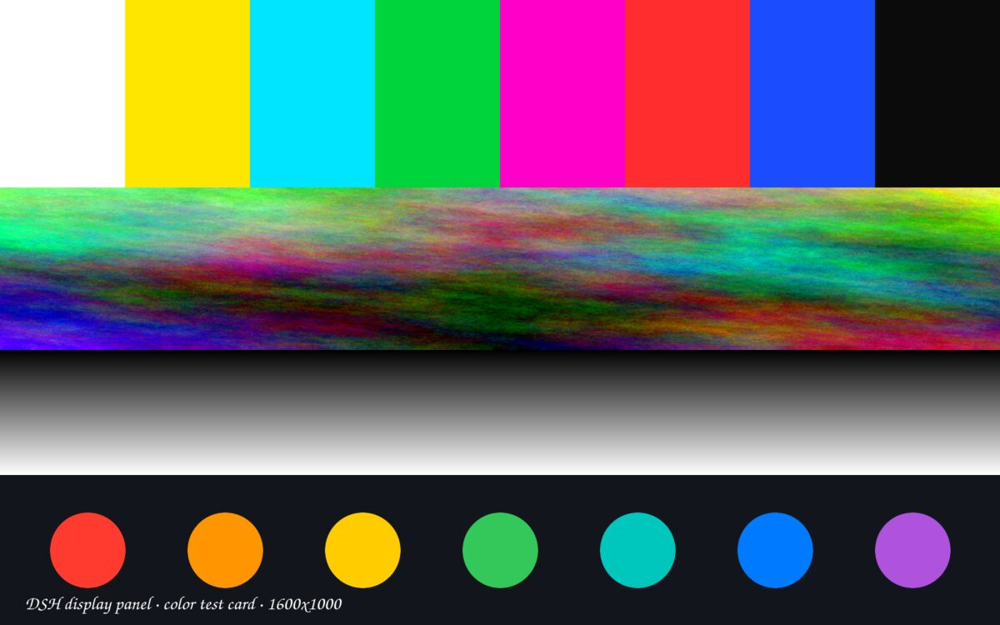
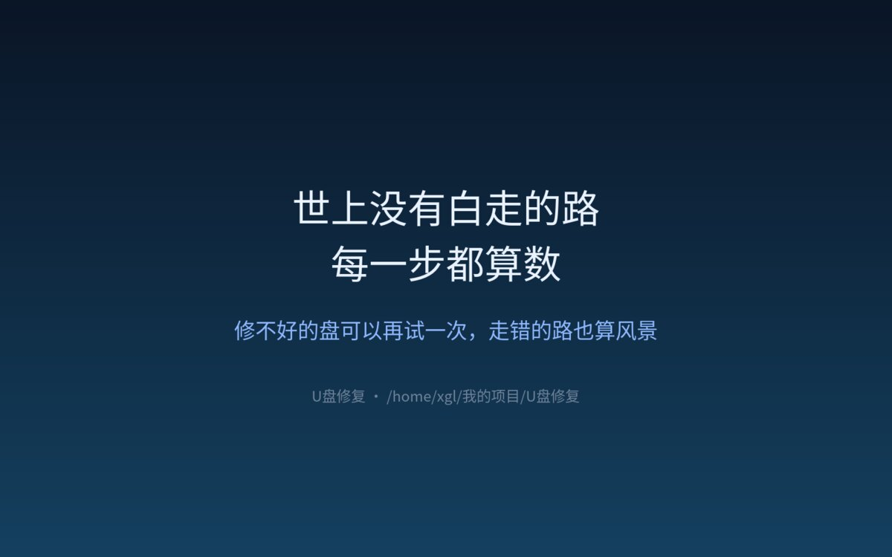
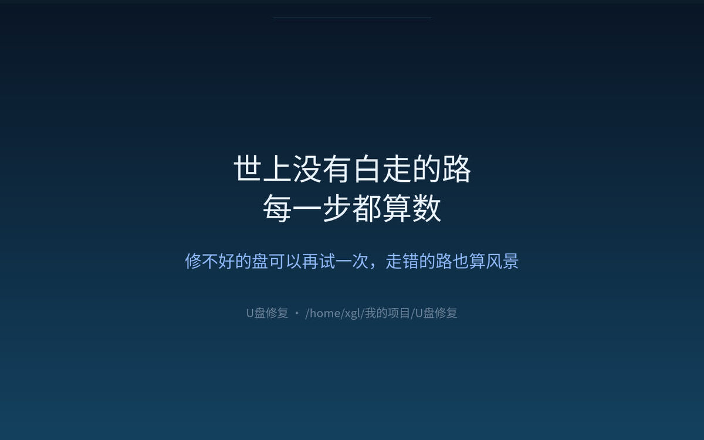
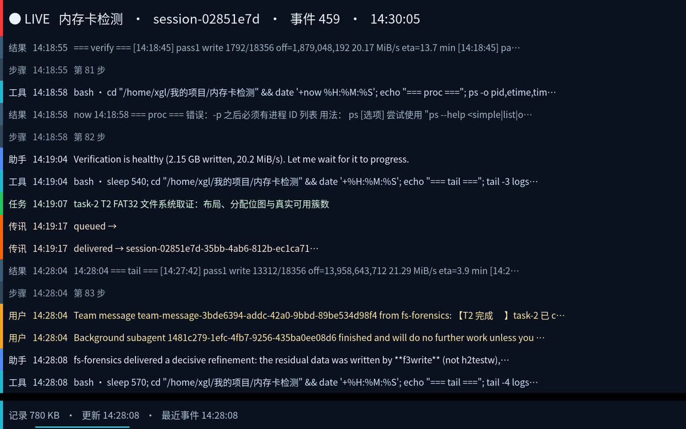

# 示例：把东西显示到某个会话的显示器上

这份文档记录三个真实的用例。它们都用同一套机制：**每个会话有自己的显示器**
（Linux 上是独立 Xvfb），面板里的「显示器」标签就是看这台显示；而宿主的 HTTP 接口
可以**指定任意会话**，所以"往另一个会话的屏幕上放东西"是可行的。

> 前置：会话的显示器是**按需创建**的 —— 第一次请求 `/exec` 或 `/frame` 时服务会为它
> 起一台 Xvfb。下面的命令都走宿主接口，所以创建是自动的。

拿到 GUI 令牌与 cookie（把 `<GUI端口>` 换成你的 DSH Web 端口，桌面版是 19387）：

```bash
TOK=$(grep -ao 'token=[A-Za-z0-9_-]*' <应用日志> | tail -1 | cut -d= -f2)
curl -s -c jar -b jar -L -o /dev/null "http://127.0.0.1:<GUI端口>/?token=$TOK"
```

往**指定会话**的显示器上跑一条命令（`session=` 就是目标）：

```bash
curl -s -b jar -X POST -H 'content-type: application/json' \
  -d '{"argv":["python3","tools/display-cards.py","show","/tmp/card.png"],"wait":false}' \
  "http://127.0.0.1:<GUI端口>/api/dsh-display-panel/exec?session=<目标会话 id>"
```

看结果（把那一帧抓回来）：

```bash
curl -s -b jar "http://127.0.0.1:<GUI端口>/api/dsh-display-panel/frame?session=<目标会话 id>" -o shot.jpg
```

---

## 1. 彩色测试图（看色偏 / 缩放 / 丢帧）



```bash
# 生成（彩条 + 等离子彩带 + 灰阶 + 七色圆点，1600x1000）
python3 tools/display-cards.py testcard --out /tmp/card.png --width 1600 --height 1000

# 铺到会话显示器上（无边框全屏、循环显示）
python3 tools/display-cards.py show /tmp/card.png --display :125
# 或走宿主接口往别的会话铺（见文首那条 curl）
```

用途：一张图同时暴露**色偏**（彩条）、**渐变断层**（灰阶）、**缩放插值**（圆点边缘）、
**压缩伪影**（彩带里的高频细节）。静止画面还是验证"去重后带宽为 0"的最好素材 ——
0.4.x 抓帧去重生效时，这张图挂在那儿每秒只发 0 个字节。

## 2. 文字卡片（把一句话投到某台显示上）



```bash
python3 tools/display-cards.py quote \
  --text "世上没有白走的路" --text "每一步都算数" \
  --sub "修不好的盘可以再试一次，走错的路也算风景" \
  --foot "U盘修复 · /home/xgl/我的项目/U盘修复" \
  --out /tmp/quote.png
```

实际铺到 U 盘修复工作区那个会话显示器上的样子：



## 3. 实时会话墙（把"这个会话正在干什么"投到显示器上）



`tools/session-wall.py` 读的是会话**自己的记录文件**
`<home>/sessions/<项目编码>/<sid>/session.v4.jsonl.zstd`（zstd 压缩的 JSONL，边写边追加；
整份解压 ~20ms，所以"文件变了就重读"既简单又实时）。画面里：

* 头部：`● LIVE` + 标题 + 会话 id + 事件计数 + 时钟（红点每秒呼吸）；
* 主体：最近 16 条事件，按类型配色 + 左侧色条（用户/助手/工具/结果/任务/成员/传讯/步骤）；
* 底部：记录文件大小 + 最后更新时刻 + 来回扫的进度线；新事件到达时底部闪一下。

```bash
# 先看看会解析出什么（不需要 X）
python3 tools/session-wall.py --file "<会话记录路径>" --dry-run

# 挂到某个会话的显示器上（走宿主接口，见文首；长驻，wait:false）
```

把它挂到**另一个**会话的显示器上，就是"看着那个会话干活"的效果 ——
适合演示，或者让旁边的屏幕显示进度。

---

## 附：这些例子里踩到的坑（都固化进工具了，改代码前先读）

1. **`display -window root` 在 Xvfb 上静默失败**（退出码 1、stderr 空）——铺图用 `ffplay`。
2. **`XCreateImage(data=NULL)` 在本机 libX11 上不分配缓冲**（`image->data` 是 NULL），
   直接 `memmove` 进去就段错误；`XDestroyImage` 还是**宏**（libX11 没这个符号）——
   会话墙里是自己 `malloc` + 手动 `free`。
3. **ImageMagick 的 `label:`/`caption:` 会换行**，还会继承外层 `-size`；再叠上 `-extent`
   的垂直居中裁剪，会把两行"叠"进一条行带（看着像文字被复制）。单行文字要用 `-annotate`，
   并且 `%` 要写成 `%%`（否则 `date '+%H:%M:%S'` 会被当转义吃掉）。
4. **别在普通 shell 里直接跑**：桌面环境的 `DISPLAY` 往往指向用户的**真实桌面**，
   脚本会画到用户屏幕上。要用会话自己的 `DISPLAY`（`display_panel_run` 或宿主 `/exec` 会给）。
